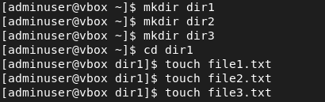
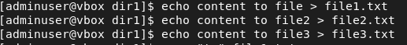
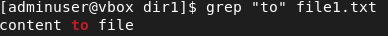
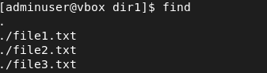
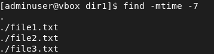

# Devops-Course
HW and exercise in Dex course

## Linux
### part 1- files and directories
- creating directories and files

- fill the files

### part 2- find and grep commands
- search the line in file1.txt contains `to`

- find file in directory

- find file in directory that modify within 7 days before

